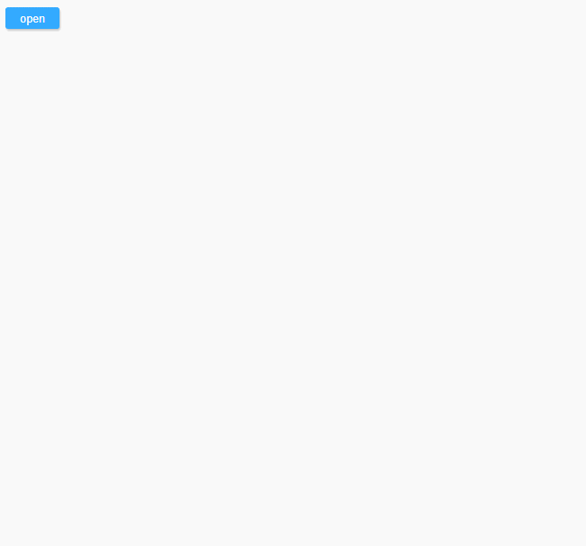

### react-modal-container
react-modal-container is modal dialogs container.

<a href="https://www.npmjs.com/package/react-modal-container"></a>
<a href="https://www.npmjs.com/package/react-modal-container"></a>

### install

```bash
npm install --save react-modal-container
```

### Examples



> index.js

```js
import React, { Component } from 'react';
import ModalContainer from 'react-modal-container';
import './index.css';

// modal component
const Modal = ModalContainer(class extends Component {
    render() {
        const { modal, onClose, name } = this.props;
        return (
            <div className="container"
                onClick={e => e.target === e.currentTarget && onClose()}
                >
                <div className="box">
                    <div className="content">
                        <span>Hello {name}</span>
                    </div>
                    <div className="closes">
                        <button onClick={onClose}>close1</button>
                        <button onClick={modal.close}>close2</button>
                    </div>
                </div>
            </div>
        );
    }
});

// app component
export default class App extends Component {
    constructor(props) {
        super(props);

        this.modal = new Modal({
            // modal props
            name: 'xiaoming',
            onClose(e) {      // -> close1
                this.close();
            },
        });
    }

    render() {
        const state = this.props.state;
        return (
            <div>
                <button onClick={this.modal.open}>open</button>
            </div>
        );
    }
};

ReactDOM.render(
    <App />,
    document.getElementById('root'),
);
```

> index.css

```css
* {
    box-sizing: border-box;
}

.container {
    width: 100%;
    height: 100%;
    display: flex;
    justify-content: center;
    align-items: center;
}

.box {
    width: 400px;
    height: 300px;
    box-shadow: 1px 2px 12px rgba(1, 1, 1, 0.26);
    background: #fff;
    text-align: center;
}

.box .content {
    padding: 20px;
    height: 250px;
}

.box .closes button {
    margin: 10px;
}

button {
    border: none;
    padding: 0.3em 1.2em;
    background: #3af;
    color: #fff;
    border-radius: 3px;
    box-shadow: 1px 2px 3px rgba(1, 1, 1, 0.24);
    outline: none;
}

button:hover {
    background: #39f;
}

button:focus {
    background: #38f;
}
```